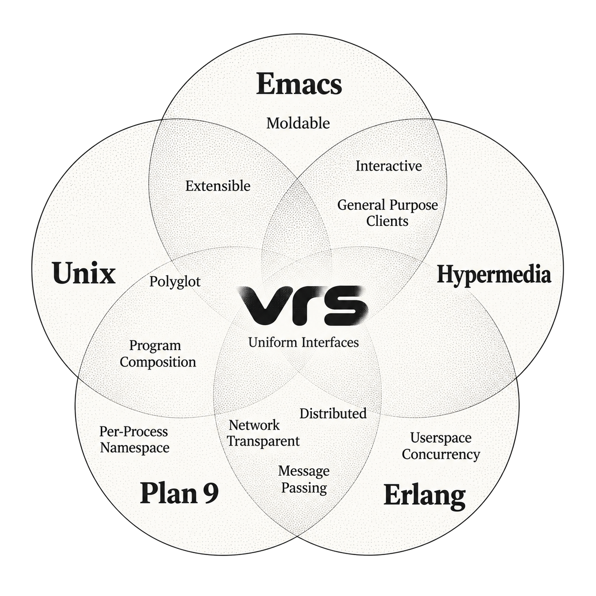

#+TITLE: Design Notes

Design principles, current mechanisms, and proposals. Sections marked as ideas,
goals, or WIP describe directions rather than promises of implemented behavior.
See [[file:docs/concepts.md][Core Concepts]] for the current programming interface.

* Mission and Approach

VRS aims to accelerate my own programming. The ambition is to let individuals
build software experiences on the scale of the world's largest software
companies, while keeping those tools understandable and changeable by their
authors.

The language, runtime, services, clients, user interfaces, editor, and access to
other devices are designed together. The unit of design is the whole path from
trying an expression to building, using, inspecting, and revising a tool. This
scope matters: a small shared vocabulary can remove repeated work between
layers that would otherwise need separate conventions.

Personal software includes small, situated tools as well as lasting programs.
An experiment may be useful once, become a daily tool, or suggest something
else to build. Continued authorship matters: using a tool should leave its
behavior accessible to inspection and revision. Play is part of the intended
experience, including finding out what is being built during building.

** Design qualities

VRS is *pragmatic* about how services are built. Services are written in Lyric,
VRS's scripting language. They can define their own behavior and compose
command-line tools, database queries, and application scripting. Their
functions are available to programs and interactive tools across connected
devices. Application-specific access is implemented in the service, where
callers can reuse it. Adapters still require implementation and maintenance.

VRS is *uniform* across its language, runtime, user interfaces, and editor.
Calls take the same form whether a service runs locally or on another connected
device. An expression tried at the REPL can become an action in a user interface.
A user action can be recorded as the expression it executes, then pasted into
source or evaluated again. An expression in the source can be replaced with a
literal representation of its result. Functions, values, expressions, and
message-based processes provide the shared vocabulary. Uniform access does not
require identical presentations.

VRS is *interactive* throughout the programming process. Build iteratively
against the running system, invoking functions and inspecting actual results
as you write. The editor is one of its clients, so editing can use the same
live capabilities as other programs. Reevaluating a service lets existing
clients use its changed behavior on subsequent calls.

Directness and economy are consequences of this design. /Direct/ describes the
short distance between an expression and the operation it performs. /Economical/
means fewer concepts and less repeated integration work. /Exploratory/ describes
learning what to build through actual results; /iterative/ and /incremental/
describe revising and extending working pieces. These are related qualities,
rather than independent features that each need another abstraction.

Composition is a way of building software. The design question is what makes it
easy to combine capabilities, inspect the result, and keep changing the program.
An operation can become part of a program, an interface action, or a call from
another device through the same interface. "Remixing" and "software scrapbooking"
describe useful moments: collecting live values, retaining a command, or putting
results from several services in one view. They support the broader live
programming model rather than define its limits.

* Technical Goals

Build an environment that enables:
- Immediate feedback while building
- Simple, universal abstractions over all aspects of programming
- One-time integration cost of data and capabilities, over multiple programs

* Influences

Emacs - An extensible environment in which using, inspecting, and programming
tools can happen together. Live extension and immediate feedback while building.

Erlang - Message based, distributed software runtime w/ userspace
concurrency. "Let It Crash" philosophy. Simple, powerful concurrency.

Hypermedia - Self-describing, uniform interface. Thin general-purpose clients.

Unix - Deliberate compatibility through stdio, pipes, and common conventions.
Small programs written in different languages can do useful work together.
VRS seeks the shell's practical, exploratory feel across modern applications
and devices.

Acme - Shared interaction conventions let an editor work with independent
programs. The editor participates in an integrating environment.

Plan 9 - Per-process hierarchical namespaces and hypermedia approach to plaintext via plumber

Related writing: [[https://www.nokia.com/bell-labs/about/dennis-m-ritchie/retro.html][Ritchie's Unix retrospective]],
[[https://9p.io/sys/doc/acme/acme.html][Pike's Acme paper]], and the [[https://www.gnu.org/software/emacs/manual/html_node/emacs/Intro.html][Emacs introduction]].

* Experience

Evaluate the experience through complete interactions:

- Discover a capability, call it, and inspect the actual result.
- Keep a useful value as source and build the next operation around it.
- Use the same capability from a second client or program.
- Revise a service and observe the change through existing callers.
- Trace a failure to the expression or adapter that needs changing.

A second consumer is a useful test of the design: does it reuse the interface,
or require another application-specific integration? The tour demonstrates
these paths; an inventory of primitives alone does not establish their value.

* Design: Uniformity

Uniformity reduces the number of conventions a programmer must learn and the
translations required between parts of a program.

VRS has uniformity:
- In representation - over data, code, and markup
- In execution - over processes, services, tasks, and interactive software
- In boundaries - over functions, clients, external programs, networks, and devices
- In interactions - over programs, users, automation, and agents.

** Economy through shared interfaces

For M capability providers and N clients, the aim is to write M service adapters
and N runtime clients, rather than M*N pairwise integrations. This is a design
target for reusable interface work, not a complexity bound on every application.
Parsing, authentication, application semantics, and client-specific presentation
still need work. The service is where application-specific access is implemented
and shared.

The same expression can be tried at the REPL, composed into another function,
or stored as an interface action. Recorded commands remain expressions that can
be edited and evaluated. This directness depends on the shared language and
calling conventions, not on the absence of abstractions.

Uniformity is about access and composition. A terminal picker, a graphical
menu, and an editor can use the same functions while presenting different
interactions. Each client implements its interaction protocol once; new actions
within that protocol can be supplied by running code.

* Architectural Components

lyric - Programming language and data format

lyricVM - Bytecode virtual machine for running lyric

vrsd - Runtime daemon that hosts and runs lyric programs

libvrs - shared client libraries

Clients - CLI programs (=vrsctl=), GUI programs (=vrsjmp=), and editors
(=emacs=) interact with runtime.

[[./assets/vrs-arch-stack.png]]

* Services and Devices

A service is a running program exposing a named collection of callable
functions. It can provide access to another application or implement the
capability itself. Programs use the service interface; its implementation can
combine whatever mechanisms are practical on its host.

Examples of this approach already in the repository:

- [[file:scripts/os_browser.ll][Browser]]: application scripting reads Safari's current page; SQLite reads
  its locally synced iCloud tab cache. Reading the cache does not force a sync.
- [[file:scripts/os_notes.ll][Apple Notes]] and [[file:scripts/antinote.ll][Antinote]]: database queries provide note data, while
  scripting or application URLs perform actions. A shared search can combine
  their results without a new integration in each client.
- [[file:scripts/feedbin.ll][Feedbin]]: an existing CLI supplies capabilities to a runtime service.

For example, composing browser data with a todo service does not require a
Safari extension for each destination. The work of obtaining the browser data
is available to a script, an automation, or an interactive tool. A desktop
widget or an aggregate agenda would be further clients to build, not capabilities
implied by the service itself.

** One programming environment across devices

Peered nodes discover services that programs can bind and call through the same
function interface. Put a capability on the device that has it: a home Mac can
host a speaker service, while a program on the laptop calls its =announce=
function. The shared interface makes the collection of devices programmable
together; remote latency and failure still matter.

=remote!= and =vrsctl --node= support sending code to another node and starting
services there. Existing service bindings follow a replacement implementation
with the same interface. Code runs with the destination's files and tools;
dependencies, startup configuration, and persistent state are separate concerns.
See [[file:docs/concepts.md::#nodes-and-peering][Nodes and Peering]] for current behavior.

* Client and Runtime

A client is a program that connects to the runtime, calls its functions, and
works with returned values. CLI tools, shell scripts, graphical applications,
and editors provide different ways to interact with the same environment.
An editor's client connection gives editing commands access to live functions
and data.

** Goals

Communication between client and runtime is a simple message-based and transport
agnostic interface.

Runtime code should be able to run in several configurations:

- Cross-process, for client and runtime processes on the same machine.
- Over-network, for thin-clients that interact with runtime on different
  machines.
- In-process, for platforms that must run client-runtime in single
  process. (E.g. Mobile)

Client API should be simple and lean so bringing up new clients is low cost.

** Runtime

A typical lifecycle of the client and runtime may look like:

1. Clients opens a bidirectional channel to runtime.
2. Client and runtime trade message over bidirectional channel via client API.
3. When the client exists, it closes the channel, and runtime frees resources
   tied to connection.

The per-client state is maintained in the runtime, so client implemenation is
lean.

The client API will offer request-response style APIs on top of message passing
for convenience, but the channel is a bidirectional.

How the runtime is started may be platform dependent:

- On desktop, runtime daemon runs via typical service management (=systemd=, =launchd=, etc).
- On cloud, runtime may be always running as a service.
- On mobile, a in-process runtime may be spun up during application initialization.

** Runtime - High Level Lifecycle

1. Runtime is initialized in host process
2. Host process begins listening on some transport for new connections
3. Host process hands-off accepted connections to runtime
4. Runtime spawns a dedicated client process per connection
5. Interactions from client connection are processed and forwarded from client
   process to other processes in the runtime.
6. Responses, if any, are forwarded back on client connection.
7. When client task ends or connection is disconnected, the client process is terminated.

** Client API

The client API should be lightweight.

It should support:

- Request / Response
- Pub / Sub - including pushes from runtime
- Hypermedia-Driven Interface

** Client Library

The client API is largely implemented by client library.

Like =libdbus=, the underlying transport should be opaque to client programs -
it may use lower-level IPC mechanisms like unix domain sockets, or TCP, without
affecting API surface between client and client library.

** Hypermedia Client

The client implementation over client API is hypermedia-driven.
See [Hypermedia]

** vrsctl - CLI client

The =vrsctl= CLI is lightweight client to runtime that offers 1-1 mapping to
client API.

Per invocation, it will:
1. Open connection with runtime
2. Send specified message(s)
3. Wait for response(s)
4. Close connection to runtime when stdin closes and all requests were processed.

CLI can be used to bootstrap new clients that is able to launch =vrsctl=
directly, or as a development tool.

* Lyric Lang

#+begin_quote
A good system can't have a weak command language.
- Alan Perlis, Epigrams of Programming
#+end_quote

** Goals

An embedded lisp dialect provides a single, uniform interface for everything -
code, data, interfaces, and protocol.

Interactions from the REPL or hypermedia interface should be exactly how the
applications are programmed, similar to how the language of the shell can be
used to write scripts.

All data, including interface markup, can be captured by the dialect's
s-expressions.

** Why write your own Lisp?

Paul Graham put it best:

#+begin_quote
A language is by definition reusable. The more of your application you can push
down into a language for writing that type of application, the more of your
software will be reusable.
— Paul Graham
#+end_quote

When the language is tailored to the environment, software can be simple and
rich, similar to how shell languages are designed around IO redirection.

It is also my impression that a bulk of software written today fall into
standard, institutionalized patterns - with engineers acting as "human
compilers" to write this code out by hand. Why not let the computer write that
code via higher-level intermediate language?

See also - [[https://en.wikipedia.org/wiki/Greenspun's_tenth_rule][Greenspun's tenth rule - Wikipedia]]

** On Interactivity and Liveliness

Runtime should be highly interactive - the experience of editing, debugging,
testing and interacting with a system should seamless - like other Lisp systems

The feeling of being inside a program:

#+begin_quote
Now second, I learned that I had never truly debugged before. The tools provided
particularly by Common Lisp and to a slightly lesser degree Clojure allow me to
be inside my program at all times. Why do print-line-debugging to find out
what's happening at a location in code when you can just be inside your program
and inspect everything live as it's running?
- Colin Woodbury (https://www.fosskers.ca/en/blog/rounds-of-lisp)
#+end_quote

#+begin_quote
It's okay to start dynamic and tighten down the API later with gradual-typing
mechanisms once the domain crystalizes.
- Simon Peyton-Jones
#+end_quote

** Lisp as the Uniform Interface

In vrs, it's Lisp all the way down:

- Scripting language is Lisp
- Modules extends runtime via bindings in Lisp
- User interfaces are s-expressions
- Hypermedia controls within interface are s-expressions
- Messages between client and runtime are s-expressions

Lisp is the substrate for code and data that ties the client, runtime, and
modules together.

Lisp is a practical choice for highly interactive, moldable,
application-specific progamming environments.

[[https://twitter.com/leoshimo/status/1694375158897574227][leoshimo - Twitter Rant on Lisp]]

*** Lisp as Hypermedia

v0.1 sketch of Lisp as Hypermedia

#+begin_src lisp
'((:text_field :id search
               :on_change on_search_text_change
               :value "query input")
  (:ul :id search_results
       (:li :content "Element 1"
            :on_click '(action_for_elem_1))
       (:li :content "Element 2"
            :on_click '(action_for_elem_2))
       (:li :content "Element 3"
            :on_click '(action_for_elem_3))))
#+end_src

* Runtime Program Execution

The runtime spawns and manages processes. These are not OS processes, but
lightweight threads of execution like [[https://www.erlang.org/docs/22/reference_manual/processes.html][Erlang -- Processes]].

Each process has its own Lisp environment for evaluating S-expressions.

Unlike Node, which uses callbacks to implement continuations, =lyric= is built
to support preemptive and cooperative multitasking during evaluation, similar to
BEAM VM.

Instead of a subscription + callback mechanism, the process's code describes
when IO is polled, when mailbox is queried, etc.

=lyric= and the runtime provides conveniences for typical patterns,
e.g. implementing long-running services, supervisors, request-response, etc.

* Process, Bytecode, and Fibers

The programs written in =lyric= support yielding - pausing and continuing
execution of bytecode sequences.

This makes it possible for runtime to drive evaluation of program via
asynchronous IO. Interpreter host captures signals yielded during program
execution, dispatches appropriate async IO, and continues execution once the IO
resource is ready.

The key motivation for this is to not tie an OS thread per paused program. A
=lyric= program waiting for IO does not block a thread, since it's runtime state
can be captured as a data structure.

E.g. A 10,000 sleeping processes "at rest" does not use 10,000 threads.

This makes it viable to model most things as programs - e.g. cron jobs are
programs that sleep in a loop:

#+begin_src lyric
(loop (sleep 10000)
      (do_a_thing))
#+end_src

Waiting is ordinary program state. A spawned indexer can run, sleep, and repeat;
a service can handle topic events alongside function calls in one event loop.
For example, a todo-completion event can trigger the external =unicornleap=
program through a separate service. This makes scheduling and reactions
programmable using the same execution model.

Spawned programs can outlive the client that started them, but their in-memory
state does not survive runtime termination. Sleeping processes are not durable
jobs. Inspecting a process's reason for waiting, including metadata that could
support supplying its next input, remains a design direction.

** What is a Fiber

A fiber is a sequence of instructions that can be cooperatively scheduled. When
it runs an instruction to yield for, control flow is returned to caller that
initiated execution of fiber.

A fiber can later be resumed when the event that fiber was paused for occurs,
such as IO, message-passing, etc.

** Fibers and Yielding

Fibers manipulated from within Lyric itself allows for arbitrary levels of
yielding calls:

- When root-fiber yields for Future
   - Top-level fiber is paused
   - Fiber driver receives future, then polls it
- When child-fiber yields for Future
   - Top-level Fiber is paused
   - Child Fiber is paused
   - Fiber driver receives future
- When root-fiber yields a value
   - Root-fiber is paused
   - Fiber driver errors for unexpected pause
- When child-fiber yields a value
   - Root-fiber is running
   - Child-fiber is paused
   - Fiber driver is not involved

* Hypermedia (WIP)

** Current mechanism

In [[file:scripts/vrsjmp.ll][vrsjmp]], a page names its item callback and entries carry =:on_click=
expressions. The GUI and [[file:scripts/vrsjmp_cli.sh][shell client]] use this protocol; the runtime evaluates
the selected action. Changing a page or action can change what existing clients
do without changing their implementations. Both the shell client and the
compiled GUI can use new actions expressed in this protocol. New kinds of
widgets or interaction protocols still require client support.

"Self-describing" refers to the data naming available actions and how to invoke
them. It does not mean every client understands every representation or can
execute arbitrary code locally. The broader document and multimodal client
architecture below is a design sketch.

** Direction

The client interface uses hypermedia between the runtime and interactive client
shells.

The design is focused on:
- Enabling speedy + simple development of interactive applications
- Supporting many thin, general purpose, client-shell application backed by same
  application code.
- Supporting client-specific, multimodal software experiences without unnecessary
  complexity on client or runtime programs.
- Ease of Automation and Testing

** High Level

Client manages connection
Connection transmits request / response / pubsub messages over connection
Documents are backed by pubsub topics
Browser manages a set of documents

** Uniform Hypermedia-Driven Interface

The hypermedia format should have a minimal, uniform interface.

The interface between client implementations should be simple and minimal, so
building new client shells requires minimal effort.

The interface should provide minimal set of markup, hypermedia controls, and
general-purpose input mechanisms so new software experiences can be built
without clients and runtime programs being updated in lockstep.

The interface should also be focused on being multimodal - i.e. the hypermedia
format should allow both GUI-driven and voice-driven client shells to leverage
the same semantic markup.

Common input mechanisms should be supported, such as Emacs =read= and
=completing-read= APIs, which should prompt user for input in a client-dependent
interface.

As a consequence of leveraging uniform hypermedia, it should be simple to build
tooling and automation on top of this interface - the data and interactions
available on that data should be represented in the markup.

For example, It should be possible to interact with interactive VRS applications
via REPL, using text-based representation of the markup, during development.

The extension of using the REPL to manipulate the "document" is to allow mental
model when *using* the software directly translate to being able to program the
software, in the same way CLI interactions translates to shell scripting, and
using Emacs translates to programming Emacs via buffer primitive. It should be
possible to "log the events" being run during a sequence of interactions, then
use that information to write a program that automates that interaction.

Unlike the Browser Ecosystem, which often uses event handlers from JavaScript to
hook interactive behavior, hypermedia data will contain the code that defines
the behavior on interaction, similar how there is behavior associated with
anchor tags and form tags.

** Goals

*Declarative*

The interface programming model is *declarative*, borrowing from
functional-reactive programming patterns from Elm, Phoenix LiveView and React.

This should also enable ease of testing and rapid UI iteration in isolation.

*Rich Linking and Object Store*

See also: Object Store

The format should enable explicit links (interactions added to application by
programmer) and implicit links (interactions natural for the data itself).

*Thin Clients*

Instead of having to replicate rich interactive experiences per client shell
implementation (i.e. build thick client applications), hypermedia should allow
thin general-purpose clients, i.e a slim web browser of sorts.

Rich interactivity is enabled by an interactive interface process that runs in
the runtime itself, a la Phoenix LiveView

Clients should *not* accumulate a large body of lyric code in client shell
binary itself, so that changes in runtime do not need recompilation of client
binary in most cases.

*Rapid Interactive Dev Loop*

The hypermedia format and tooling should enable interactive development loop for
building and testing UI.

** Conceptual Analogies to Emacs and Web Browsers

Hypermedia document is to VRS what buffers are to Emacs, and HTML document / DOM
is to Web Browsers.

It is the representation for data, interface, and behavior.

In a sense, each client is a minimal pseudo-browser for presenting interfaces
for given hypermedia data.

** Client as a Pseudobrowser

It may be helpful to conceptualize the client shells as a pseudo-web-browser of
sorts, as far as runtime is concerned.

While runtime processes may respond with hypermedia data, the client manages the
"tabs" of this markup across variety of different sources, similar to a web browser.

In this way, the contract between client and runtime stays simple - there is a
bidirectional channel which is used for RPC and Pub/Sub traffic. For example,
there can be a collection of topics published from the runtime, which client
subscribes to. Each of those topics can contain the hypermedia representing the
"page".

** Inspirations

- Hypermedia Driven Web Applications
- [[https://github.com/phoenixframework/phoenix_live_view][Phoenix LiveView]]
- Emacs
- [[https://guide.elm-lang.org/architecture/][The Elm Architecture]]
- [[https://htmx.org][HTMX]]

** Lifecycle Overview

When a hypermedia client connects to runtime, a client process representing the
user interface is spawned in the runtime. There is a dedicated bidirectional
channel between the client and runtime's process for that client.

The client process communicates with other processes running in the runtime, and
sends user interface hypermedia over the channel. The hypermedia contains
self-describing data and hypermedia controls.

Client renders the hypermedia format in client-dependent format, e.g:
- A TUI client shell renders markup as plaintext.
- A GUI client shell renders markup in Native UI or Browser-based Renderer.
- A voice client shell "renders" markup as STT audio.

When the user interacts with the interface, registered events are sent from the
hypermedia client to the client interface process, which updates internal state,
and pushes updated hypermedia data back to client if needed.

The updated markup is received by hypermedia client, which itself updates what
is shown to the user.

The connection is bidirectional:
- Client can dispatch commands, which sends messages to interactive process
- Runtime can notify clients via Pub / Sub topics the client registered itself for

** Features

Element Selector
- API to specify elements on page, similar to CSS selectors
- Used to specify targets for different interactions, e.g. toggling visibility of =#element=

Navigation
- TODO: What Navigation Primitives make sense? URLs? Stacks of "Views"?

General Purpose Inputs
- High-level primitives like Emacs =read= and =completing-read= allow triggering
  standardized input behavior in a way that is appropriate for hypermedia client
  implementation

* Object Store

** Current entity/action mechanism

Tagged values and =interactive= function metadata already support action
discovery. =entity_functions= examines bound functions for a matching first
argument tag; it does not execute actions or completion providers. A =ps=
adapter can decode output into =:os/process= values, inspect each intermediate
result at the REPL, and offer =copy_pid= or =terminate_process= through metadata.
Emacs actions and vrsjmp's Cmd-K menu use the same query. Completion providers
supply live argument choices when requested.

These are ordinary values and functions; the metadata guides interaction rather
than enforcing types. See [[file:docs/concepts.md::#entities-and-completions][Entities and Completions]]. A persistent object store,
automatic relationship graph, and proactive suggestions below are proposals.

** Object store proposal

*What is it?*
General Purpose, Object Store that's focused on linking data and functionality
on that data.

At its heart, it hopes to allow rich interop and workflows across different
pieces of software in the runtime.

If a "program" in VRS is:
- Data represented in Object Store
- Functions that have side effects on data in object store
- Functions that generate hypermedia interface on data in object store

It should be possible that data, functionality and interfaces between different
pieces of software can compose more naturally.

Principle: Programs (including data, capabilities, and interface) should be
composable in ways that the wasn't thought about when original program was
written.

The format allows explicit links (interactions added to application by
programmer) and implicit links (interactions natural for the data itself).

** Inspirations

- [[https://github.com/oantolin/embark][Emacs Embark]]
- [[https://mail.gnu.org/archive/html/hyperbole-users/2019-01/msg00037.html][GNU Hyperbole]]
- ECS Patterns in Game Dev

#+begin_quote
Rather than manually specifying relationships between bits of information, we
need a system that can see these connections simply by taking context and
content into account... Hyperbole itself, however, should be thought of as an
extensible "information enabler", automatically turning inert documents into
active ones, through the process of recognizing implicit buttons and giving you
multiple ways to interact with those buttons. It's just like what Wiki did for
text, but now for lots of other things, and in many more ways.
- John Wiegley
#+end_quote

#+begin_quote
humans must too often carry their data from program to program... Why should
humans do the work? Usually there is one obvious thing to do with a piece of
data, and the data itself suggests what this is.
- Rob Pike

http://doc.cat-v.org/plan_9/4th_edition/papers/plumb
#+end_quote

** Features

Target-Action Links
- API to associate a collection of actions with specific types of data -
  i.e. data shaped a certain way can be passed to some function.
- Like Embark - allow chaining actions based on the shape of data interactively

- Read / store data
- Allow links between pieces of data for a specific "entity" -  data graph.
- Invoke functionality from linked entity data directly, like Emacs Embark
- Proactively suggests links and functionality

** Ideas

An interactive application is: Functions that modify state, Functions that
create markup from state.

Like Embark - Support workflows like =embark-act= and =embark-collect= across a
collection of VRS applications

Entity system that automatically enabled dynamic interface generation and interaction?

Features like Emacs =(interactive)= that allows an interface to be created from
the function implementing that capability directly.

Reusable Interface Components
- Rendering should allow composition and reuse - a view of data can be used
  across "applications" or interactive shells without being tied down to
  specific application

Allow easy "linking" experience - i.e. in one software experience, I can select
an entity, search for related entity, and link them all within same workflow.

* Internals
** Async Tasks in Runtime

A high level mental model for async tasks in runtime is:

- A single kernel task
- A collection of shared system services:
   - A single service registry task
   - A single pubsub task
- Kernel task manages multiple process tasks
- Each process task has:
   - A dedicated mailbox task
   - A optional controlling terminal task
   - Handles to kernel and shared services such as service registry and pubsub

* Characteristics

Interesting Characteristics of System

** Live inspection and source

The [[file:docs/guide-emacs.org][editor]] provides access to the running system while code is being written.
As a runtime client, it can invoke the same functions as other programs,
including functions that provide choices or construct code. Inspection happens
against actual application data. An expression can be replaced in source with
a literal representation of its evaluated result. That result can become a
fixture, a starting value, or material for the next program. Only values
representable as source can be retained this way.

This supports an incremental loop: evaluate an expression, inspect its result,
and choose the next change from what was learned. Source can also invoke code
generators, including generators for interface data; their results can be
inspected and inserted as code. The programmer can ask the system questions
while constructing a program instead of predicting every intermediate result.

Reevaluating the code that starts a service with =spawn_srv!= replaces its
process. Existing callers with compatible bindings use the replacement on
subsequent service calls, including across devices. This applies to CLI tools,
scripts, editors, and graphical applications; they need not be rebuilt to use
changed service behavior. Clients that support the service's interaction
protocol can also use new actions expressed through that protocol. This does
not migrate old stack frames or preserve service state automatically.

[[file:docs/guide-debug.org][Source-associated debugging]] uses =dbg!= to capture calls, arguments, and
results in bounded runtime history, available to viewers and through
=dbg_history=. This makes an observation beside the source reusable as a tool.
Spawned processes and remote handlers need their own observation blocks;
stepping and time-travel replay are separate design work.

** Commands as editable programs

The command execution helpers and vrsjmp publish selected expressions to =:cmd=.
A subscriber can inspect that stream or collect expressions into a =begin=
form. [[file:scripts/cmd_macro.ll][Command macros]] use the service event loop to record these forms for
later evaluation. Observation, manual repetition, and programmatic recording
share the same representation. The expression behind a recorded user action
can be pasted into source, edited, or run again using the ordinary evaluator.

Publication is explicit, not an automatic log of every function call. Evaluating
a recording performs the operations again against current state; it does not
restore the earlier environment. Pub/sub is currently node-local and best-effort,
with no replay for late subscribers. A local event handler can still call a
service on another device.

** Code as data

Lyric uses s-expressions for data, code, and interface descriptions. Constructing
a program or an interface uses the same list operations and quotation as other
data construction. A generator called by the editor is also callable by another
program; its result can be inspected before evaluation.

Live queries can supply data while constructing a program or a prompt. This
reduces the need to transcribe application state or predict it from memory.
[[file:docs/ai.md][AI and VRS]] applies this to code and interface generation. The underlying
capability belongs to ordinary programs as well as agents.

* Word Cloud

- Homoiconicity:
   - in representations of data, code, interface
   - in interactions of users, programs, automation, agents
- Data as implicit buttons (GNU Hyperbole, Plan 9 Plumber)
- Compute Fabric: 
   - Software experiences are universal across multiple surfaces, devices,
     platforms, and modalities
   - The collection of my devices feel like one whole computer

* VRS and Agents

[[file:docs/ai.md][AI and VRS]]

* Open Design Questions

- How should service startup, dependencies, ownership, and state preservation
  fit the live editing model across devices?
- What delivery, ordering, and recovery contract should cross-device pub/sub
  provide before it becomes part of the shared service interface?
- How can process waiting reasons be inspected and acted upon without confusing
  observation, cancellation, and supplying an awaited value?
- What minimal interaction protocol supports richer clients, including a web
  client and an executable tour, while keeping application actions in services?

* References

[[https://www.youtube.com/watch?v=8Ab3ArE8W3s][Strange Loop 2022 - Stop Writing Dead Programs]]
[[https://caseymuratori.com/blog_0015][Semantic Compression]]
[[https://www.youtube.com/watch?v=8pTEmbeENF4][Bret Victor   The Future of Programming - YouTube]]
[[https://notes.andymatuschak.org/zKKB5ENRahwftH96H7mijiu][Andy Matuschak - Premature scaling can stunt system iteration]]
