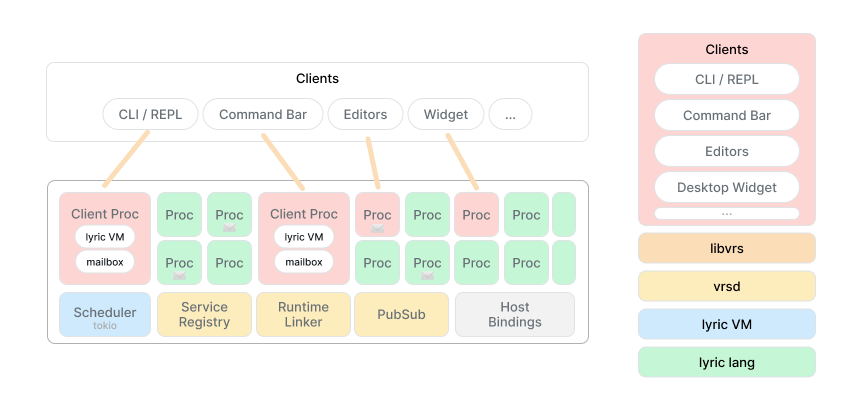

# VRS Manual

Begin with the shape of the running environment, evaluate a small program,
then give it a service interface. Later sections cover individual tasks and
contracts without requiring a linear read.

The [tour](tour.md) demonstrates the environment; [Design decisions](design.md) explains
its choices. This manual covers the runtime, language, editor, debugger, and
command-line interface. Start here, then use the contents to look up a topic.


<a id="how-vrs-runs"></a>

## How VRS runs

The daemon `vrsd` hosts the runtime. A client connects and evaluates Lyric
expressions in a process inside it. A process has an environment and a mailbox.
A service is a process registered under a name, with functions other programs
can call.

| Part | Role |
| --- | --- |
| `lyric` | Language, values, compiler, and bytecode interpreter. |
| `libvrs` | Runtime and client libraries. |
| `vrsd` | Daemon hosting the runtime and accepting connections. |
| `vrsctl` | CLI for expressions, scripts, a REPL, subscriptions, and debugging. |
| `:vrsjmp` | Service supplying user interface descriptions and executing selections. |
| `vrsjmp` and `vrsjmp-terminal` | Desktop and terminal clients of that service. |
| `vrs-mode` | The editor connection and editing commands for Emacs. |



A client connection and a service have different lifetimes. Disconnecting a
client ends its evaluation process; child services it started can keep running.
A new CLI invocation does not restore earlier definitions. Persistent REPL and
editor sessions retain their definitions and service bindings.

Each VRS process runs a Lyric fiber in an async task. `recv`, `sleep`, and I/O
can suspend it without reserving an OS thread. CPU-bound code is not preempted.
Spawned processes copy bindings, but closures can retain shared mutable
environments; this is not complete memory isolation.


<a id="start-and-evaluate"></a>

## Start and evaluate

The repository uses Rust and Cargo. `./serve` installs a matching `vrsctl` and
starts the release runtime and desktop app with the [personal service configuration](../scripts/init.ll).
Adapters may depend on installed applications or separate CLIs.

```sh
./serve          # Runtime and desktop app.
./serve headless # Runtime and configured services.
./serve dev      # Debug runtime and matching client.
```

For a runtime without that init file, use two terminals in the checkout:

```sh
cargo run --locked --bin vrsd
```

```sh
cargo run --locked --bin vrsctl
```

These Cargo invocations use the debug profile. An installed CLI must match the
daemon's profile or explicitly choose its socket. In the REPL:

```vrs
(+ 20 22) # => 42
(defn! double (x) (+ x x))
(double 21) # => 42
(help recv)
(ls_env)
```

The [language chapter](manual.md#lyric) covers values, functions, quotation, and macros.
The following sections add runtime facilities to that language.


<a id="lyric"></a>

## Lyric

Lyric is VRS's small, lexically scoped Lisp. Functions are values, programs are
symbolic expressions, and quotation lets programs work on code as data. It is
designed for dynamic scripting, native bindings, and embedding in Rust.

Examples within a section may use earlier definitions. Enter expressions in
`vrsctl` or the [editor](manual.md#editor).


<a id="values-and-bindings"></a>

### Values and bindings

Numbers, strings, keywords, booleans, and `nil` evaluate to themselves.
Symbols name bindings. Ordinary calls use `(function argument ...)` and
evaluate the function and arguments from left to right. `#` starts a line comment.

```vrs
(+ 20 22)                          # => 42
(list 42 "hello" :ready true nil)   # => (42 "hello" :ready true nil)

(def message "hello lyric!")
message                           # => "hello lyric!"
(set message "goodbye lyric!")
message                           # => "goodbye lyric!"
```

`def` creates or replaces a binding in the current scope. `set` updates the
nearest existing binding, and errors if none exists. `let` introduces local
bindings; their initializers run in the surrounding scope. `begin` evaluates
several expressions in order and returns the last value without a new scope.

```vrs
(def amount 40)
(let ((amount 2) (original amount))
  (+ original amount))             # => 42
amount                             # => 40
(begin (set amount (+ amount 1))
       (+ amount 1))               # => 42
```

Regular strings use escapes such as `\n` and `\"`. Triple-quoted strings
preserve quotes and backslashes. Indented multiline blocks drop the opening
newline and common indentation; the final newline remains. Neither string
syntax interpolates expressions.

```vrs
(def text """
    say "hello"
    C:\notes
    """)
text                               # => "say \"hello\"\nC:\\notes\n"
```


<a id="functions"></a>

### Functions

`fn` and `lambda` are synonyms. `defn!` names a function, and the last body
expression is its return value. The `!` marks a macro call; we'll define one
below. Ordinary function calls need no marker.

```vrs
(defn! double (x)
  (+ x x))
(double 21)                        # => 42
((fn (x) (+ x 1)) 41)               # => 42

(defn! with_value (x f)
  (f x))
(with_value 21 double)              # => 42
(with_value 41 (lambda (x) (+ x 1))) # => 42
```

Functions close over their lexical bindings, including bindings updated with
`set`:

```vrs
(defn! make_counter (count)
  (fn ()
    (set count (+ count 1))
    count))
(def next (make_counter 0))
(next)                             # => 1
(next)                             # => 2
```


<a id="lists-and-keyword-fields"></a>

### Lists and keyword fields

Quote (`'`) returns a form as data. `list` constructs a list from computed
values. The empty list is `'()`, distinct from `nil`. `get` uses zero-based
indexes, accepts negative indexes from the end, and returns `nil` when absent.
`push` returns a new list with an element appended; it leaves the original
value unchanged.

```vrs
(def numbers '(1 2 3))
(get numbers 0)                     # => 1
(get numbers -1)                    # => 3
(first numbers)                     # => 1
(last numbers)                      # => 3
(first '())                         # => nil (last also returns nil)
(get numbers 9)                     # => nil
(contains? numbers 2)               # => true
(len numbers)                      # => 3
(push numbers 4)                    # => (1 2 3 4)
numbers                            # => (1 2 3)
(eq? '() nil)                       # => false
```

Records are ordinary flat lists with keyword/value fields. With a keyword,
`get` finds its first occurrence and returns the following element.
`map` and `filter` take the list first, then the function. `apply` calls a
function with a list of argument values.

```vrs
(def item '(:title "Notebook" :pages 80))
(get item :title)                   # => "Notebook"
(get item :missing)                 # => nil
(list :title (get item :title)
      :pages (+ (get item :pages) 1))
# => (:title "Notebook" :pages 81)

(map '(1 2 3) (fn (x) (+ x x)))     # => (2 4 6)
(filter '(0 1 0 2) (fn (x) (not? (eq? x 0))))
# => (1 2)
(apply + '(10 20 12))               # => 42
```


<a id="control-flow-and-patterns"></a>

### Control flow and patterns

`if` evaluates only the selected branch; an omitted else branch returns
`nil`. False conditions are `nil`, `false`, `0`, `""`, and the empty list.
Nonzero integers, nonempty strings/lists, and `true` are true conditions.
Other types, including keywords and symbols, are invalid conditions.

```vrs
(if (eq? 2 2) "equal" "different") # => "equal"
(if false "yes")                   # => nil
(if 0 "nonzero" "zero")            # => "zero"
(not? '())                         # => true

(cond ((eq? 3 1) :one)
      ((eq? 3 2) :two)
      (true :many))                # => :many
(when! true (+ 20 22))              # => 42
(and! false (error "skipped"))      # => false
(or! nil "fallback" (error "skipped")) # => "fallback"
```

`cond` selects the first true clause. `when!`, `and!`, and `or!` are standard
macros; `and!` and `or!` stop as soon as their result is determined and return
the last evaluated value.

`match` compares a value with patterns in order. Keywords and other literals
match themselves, symbols bind matched values, and `_` ignores a value.
`def` can also destructure a value, raising an error if the pattern fails.

```vrs
(def result '(:ok (20 22)))
(match result
  ((:ok (a b)) (+ a b))
  ((:err reason) reason)
  (_ "unknown result"))            # => 42

(def (:ok (left right)) result)
(+ left right)                     # => 42
```

`try` turns a raised error into an error value; a successful result passes
through unchanged. `err?` and `ok?` inspect that distinction. A list tagged
`:err` is still just a list, not a raised error.

```vrs
(try (+ 20 22))                    # => 42
(err? (try (error "missing item"))) # => true
(ok? (try (+ 20 22)))               # => true
(err? '(:err "ordinary data"))      # => false
```


<a id="quotation-and-code-templates"></a>

### Quotation and code templates

Reading produces data; evaluating runs it. `'FORM` is shorthand for
`(quote FORM)`. `pretty` returns readable text, useful for inspecting a form
or reading it back.

```vrs
(def code '(+ 20 22))
code                               # => (+ 20 22)
(get code 0)                       # => +
(eval code)                        # => 42
(read "(+ 20 22)")                 # => (+ 20 22)
(eval (read "(+ 20 22)"))           # => 42
(pretty code)                      # => "(+ 20 22)"
(eq? (read (pretty code)) code)     # => true
```

Backtick starts a template. Comma inserts one evaluated value; comma-at
splices the elements of an evaluated list. The template constructs code
without running the resulting call.

```vrs
(def base 20)
(def extra '(10 12))
(def code `(+ ,base ,@extra))
code                               # => (+ 20 10 12)
(eval code)                        # => 42
`(values ,extra ,@extra)            # => (values (10 12) 10 12)
```

When generated code should receive a list or symbol as literal data, include
the quote that the future call needs:

```vrs
(def item '(:title "Notebook" :pages 80))
(def code `(get ',item :title))
code                               # => (get '(:title "Notebook" :pages 80) :title)
(eval code)                        # => "Notebook"
```

Splices require lists, including `'()`; `nil` is not an empty splice. Nesting and evaluation rules follow below.


<a id="template-evaluation-and-nesting"></a>

#### Template evaluation and nesting

The exact reader forms are `(quasiquote FORM)`, `(unquote EXPR)`, and
`(unquote-splicing EXPR)`. Reading never executes them. Quasiquote evaluates
active holes once, in left-to-right order, in its surrounding lexical scope.
Inserted values are not rescanned or executed. Splices require lists: `()` is
empty, while `nil` and strings are errors. A splice must occupy a list-element
position; ordinary calls still use `apply` for a list of argument values.

When generating a call that should receive a symbol or list **as data**, keep
a quote around the inserted value:

```vrs
(def window '(:os/window :id 42))
`(focus_window ',window)
# => (focus_window '(:os/window :id 42))
```

Quote inside a template is ordinary structure, so `',window` captures the
value inside a future quote. An outer quote makes its entire operand literal.
Nested backticks increase quotation depth; commas remove one level:

```vrs
(def x 7)
`(outer `(inner ,x ,,x))
# => (outer (quasiquote (inner (unquote x) (unquote 7))))
```

Unquote outside a template, misplaced splices, and marker forms with the wrong
number of arguments are errors. Regular and triple-quoted strings do not
interpolate. Comma and backtick are reserved outside strings/comments; `!` and
`@` remain symbol characters. `,@name` splices `name`; `, @name` inserts the
value of `@name` without splicing. Both compact and pretty printers preserve
that distinction. Templates use ordinary `Form` lists and retain the existing
serialization shape. They do not qualify symbols or provide macro hygiene.

Use list construction for computed elements and templates when showing the
resulting structure helps. Records and executable forms are both ordinary lists.


<a id="documentation-and-metadata"></a>

### Documentation and metadata

A function's leading string is its docstring. `help` returns it, and `meta`
returns a keyword-field list with the function's argument names and metadata.
`with_meta` returns a lambda with the supplied metadata; its real argument
names are retained. `ls_env` lists visible bindings as symbols.

```vrs
(defn! double (x)
  "Add a number to itself."
  (+ x x))
(help double)                      # => "Add a number to itself."
(get (meta double) :args)           # => ((:name x))
(def labelled (with_meta double '(:category :math)))
(get (meta labelled) :category)     # => :math
(labelled 21)                      # => 42
(contains? (ls_env) 'double)        # => true
```


<a id="macros"></a>

### Macros

A macro receives unevaluated expressions and returns code. Define it with
`defmacro` and call it with `!`:

```vrs
(defmacro unless (condition & body)
  `(when! (not? ,condition) ,@body))

(unless! false (+ 20 22))               # => 42
(unless! true (error "should not run")) # => nil
```

`& body` collects the remaining expressions. A function evaluates its arguments
before the call; a macro can choose which expressions run. Redefine a macro and
evaluate its call again to try the new version.

`and!` stops at the first false value; `or!` stops at the first true value:

```vrs
(and! (list? window) (get window :id))
(or! (get window :title) "Untitled")
```

Both return the last value evaluated. Like `if`, they treat `nil`, `false`, `0`,
`""`, and `'()` as false.


<a id="inspecting-an-expansion"></a>

#### Inspecting an expansion

Quote the call to see the code it produces:

```vrs
(macroexpand_1 '(unless! false (+ 20 22)))
# => (when! (not? false) (+ 20 22))

(macroexpand '(unless! false (+ 20 22)))
# => (if (not? false) (begin (+ 20 22)) nil)
```

`macroexpand_1` expands once. `macroexpand` continues while the result is another
outer macro call; it does not expand calls nested inside that result. Neither
executes the returned code, but both run the macro body.


<a id="scope-and-helpers"></a>

#### Scope and helpers

Macros can call ordinary functions. You do not need `for_syntax`; it behaves
like `begin`. Define helpers with `defn!` as usual.

The macro body uses definitions from where the macro was defined; the code it
returns runs in the caller's scope. To evaluate an expression using variables
at the call site while building that code, use `eval_caller`:

```vrs
(defmacro remember (expression)
  (def value (eval_caller expression))
  `(quote ,value))

(defn! example (x)
  (remember! (+ x 1)))

(example 41) # => 42
```

Here `eval_caller` sees the caller's `x`. It is only available while a macro is
expanding. Ordinary `eval` uses variables visible where it is called.


<a id="generated-names"></a>

#### Generated names

Use `gensym` for temporary variables introduced by a macro:

```vrs
(defmacro or_else (expression fallback)
  (def temp (gensym "value"))
  `(let ((,temp ,expression))
     (if ,temp ,temp ,fallback)))

(def value 42)
(or_else! false value) # => 42
```

This evaluates `expression` once. Naming the temporary `value` would hide the
caller's `value` in the fallback. `gensym` creates a fresh name starting with
`value__`, avoiding that collision.


<a id="expansion-execution-and-limits"></a>

#### Expansion execution and limits

`defn!` expands `(defn! NAME PARAMS BODY...)` to
`(def NAME (fn PARAMS BODY...))`. A nested definition is checked when execution
reaches it. `(defmacro defn ...)` replaces the macro for subsequent definitions;
existing function values are unchanged.

Standard macros include `when!`, `and!`, and `or!`. `and!` stops at the first
false value; `or!` stops at the first true value, using the same conditions as
`if`. Both return the last evaluated value, evaluate each operand at most once,
and skip the remaining operands. `(and!)` returns `true`; `(or!)` returns `nil`.

`macroexpand_1` runs one outer transformer; `macroexpand` repeats only at the
outermost position. Neither executes its returned program or walks quoted data.

Macros expand when execution reaches the call, including inside a function or
loop. The transformer runs on the same fiber as ordinary code and can call
ordinary helpers, mutate state, yield, or await host functions. Its result must
still be source data; opaque runtime values cannot be embedded in an expansion.
The result is compiled and evaluated in the call's scope. Unexecuted branches
are not expanded. Redefining a macro changes subsequent calls in existing
functions; expansions are not cached.

Transformers capture their definition's lexical environment, just like lambdas.
`(eval_caller FORM)` explicitly evaluates an argument's source in the active
macro call's environment, and works from helper functions too. Ordinary `eval`
retains its lexical behavior. `for_syntax` is no longer necessary; its old spelling
is accepted as an alias for `begin`.

`macroexpand_1` and `macroexpand` execute transformers with the same permissions
as an actual call. They do not execute the returned program, but transformer
effects still happen. Quote the call being inspected. Use `(gensym "hint")` for
fresh printable local names; there is no implicit qualification or automatic
hygiene for free identifiers.

Macro definitions belong to a process. A spawned process receives a snapshot of
the definitions; it can redefine them independently. No macros are transported
with quoted source data; the evaluating process needs its own definitions.

Each expansion chain is bounded by 1,000,000 transformer instructions, 10,000
macro invocations, and 1,000,000 accumulated output nodes. Expansion also checks
call depth (256 frames) and nested transformer depth (64). Intermediate values
have size bounds. Source nesting is limited to 256 levels, including in `read`.
Generated code runs outside the transformer instruction budget. Independent
invocations start fresh budgets and can recover after a caught expansion error.
These limits do not put a wall-clock timeout on I/O initiated by a transformer.


<a id="readable-values"></a>

### Readable values

`(pretty VALUE [WIDTH])` returns a formatted string (default width 90; explicit
widths must be positive integers). Small lists stay on one line. Larger lists
wrap with indentation, keeping small keyword/value pairs together. Oversized
nested values start below their keyword:

```vrs
(pretty '((:name :echo :node "alpha" :interface ((ping x) (pong y)))
          (:name :clock :interface ((now)))) 40)
```

The string contains:

```
((:name :echo
  :node "alpha"
  :interface ((ping x) (pong y)))
 (:name :clock :interface ((now))))
```

Serializable values round-trip through `(read (pretty VALUE))`. Strings are
escaped, quote prefixes are preserved, and opaque runtime values keep their
existing display notation. Width is measured in display columns and is a target:
atoms are not split, scalar keyword/value pairs stay together, and deeply nested
values may exceed it. The formatter never truncates a value.

Rust embedders can use `Form::to_pretty_string(width)` and
`Val::to_pretty_string(width)`. Width zero is treated as one column in this Rust
API. `Display` and `(display ...)` stay compact, abbreviating quotation forms;
wire serialization retains the same atoms-and-lists representation.
The Rust `Form::RawString` variant is verbatim display text, not a readable
string literal.


<a id="embedding-and-source-observations"></a>

### Embedding and source observations

`(dbg! BODY...)` runs like `begin`, while an optional host observer records its
calls, returns, errors, and cancellation. Hosts attach a `debug::Observer` through
`Fiber::set_observer`. Without an observer, the body executes normally without a
recording. The observer must never block on a viewer or reenter the fiber.

`parse_source` retains file, line, column, and expression provenance through
macro list operations. The compiler embeds call/function source descriptors;
`(eval_source SOURCE FILE LINE COLUMN)` evaluates located text in the current
lexical scope. See VRS's [source-embedded debug tools](manual.md#editor)
for the macro, recording policy, clients, and limits.


<a id="services"></a>

## Services

Define the functions before starting a service:

```vrs
(defn! echo (message) message)
(spawn_srv! :echo :interface '(echo))
(bind_srv :echo)
(echo "hello") # => "hello"
```

`spawn_srv!` returns the child's PID after local registration and subscriptions
are ready, or raises an error if the child exits first. This is not a health
check and has no startup deadline. `srv!` serves in the current process instead.
Omitting `:interface` means an empty list, useful for event-only services.


<a id="discovery-and-binding"></a>

### Discovery and binding

```vrs
(ls_srv)
(find_srv :echo)
(info_srv :echo :interface) # => ((:echo message))
(info_srv :echo :interface_doc)
```

`bind_srv` installs message-passing function stubs in the calling environment,
including exported metadata and completion providers. Exported names replace
existing bindings of the same name. With the window service running:

```vrs
(bind_srv :os_window)
(get_windows)
(help focus_window)
```

The editor can browse registered services or already-bound functions; see the
[editor chapter](manual.md#editor) for those two workflows.


<a id="replacement-and-state"></a>

### Replacement and state

Reevaluating a script containing `spawn_srv!` replaces the local service with
that name. Compatible bindings follow the replacement. Bind again to import
newly added exported names.

A service retains its exported functions. Redefining an export in a separate
REPL alone does not replace it there. Closures can share captured environments;
service replacement is the explicit update operation used in the tour.

Replacement does not preserve in-memory state or migrate stack frames.
`spawn_srv!` cannot kill a process on another node. To move a service, stop its
old instance before starting the new one. Remote evaluation does not provide
automatic singleton management.


<a id="processes-and-messages"></a>

## Processes and messages

`spawn` starts a process. `self` returns the current process's ID; `send` and
`recv` exchange values:

```vrs
(def parent (self))
(spawn (fn () (send parent '(:greeting "hello"))))
(match (recv)
  ((:greeting message) message)) # => "hello"
```

`call` sends a request and waits for its reply. `call_timeout` sets the deadline
in seconds for this process's calls:

```vrs
(call_timeout 10)
(call (find_srv :echo) '(:echo "hello"))
```

`ps` lists runtime processes, `self` returns the current PID, and `kill` stops a
process. `ls_msgs` inspects queued messages without consuming them. A pattern
passed to `recv` waits for a matching message and leaves other messages queued.

```vrs
(send (self) '(:notice "ready"))
(ls_msgs)
(recv '(:notice _)) # => (:notice "ready")
```

A message loop can dispatch on patterns. `srv!` supplies the usual request and
response loop for exported functions.


<a id="deadlines-and-cancellation"></a>

### Deadlines and cancellation

The default call deadline is five seconds for local and remote calls.
`call_timeout` changes it for the current process. Calls are not retried
automatically. A timeout ends the wait; it does not establish that the service
stopped. Retrying may repeat effects. Cancellation does not roll back work
already done.


<a id="waiting-and-recurring-work"></a>

### Waiting and recurring work

```vrs
(def worker
  (spawn (fn ()
    (loop
      (publish :tick "another minute")
      (sleep 60)))))
(kill worker)
```

A child can outlive its starting client, but its state is in runtime memory.
A sleeping worker is not also answering service requests. Use a separate
process for responsive controls when the worker can stay busy or asleep.


<a id="events-and-subscriptions"></a>

## Events and subscriptions

Subscribe to a topic to receive its future publications:

```vrs
(subscribe :clock)
(publish :clock '(:tick 1))
(recv) # => (:topic_updated :clock (:tick 1))
```

Earlier publications are not replayed to new subscribers.

Services can react to topics alongside their ordinary calls:

```vrs
(defn! celebrate (task) (exec "unicornleap"))
(spawn_srv! :celebration
  :topics '((:todo_completed celebrate)))
```

Each handler receives the published value and shares the service's state.
Both `srv!` and `spawn_srv!` default to an empty interface when `:interface`
is omitted, so a service that only responds to events needs no export list.
Events are node-local and best-effort; publishing does not wait for handlers
to finish.


<a id="external-programs"></a>

## External programs

`exec` returns a program's exit status, stdout, and stderr. `decode` turns text
into values:

```vrs
(def result (exec "printf" "one\ntwo\n"))
(decode :lines (get result :stdout)) # => ("one" "two")
```

For macOS launch helpers, bind `:os_browser` to use `open_url`, or `:os_apps`
to use `open_app` and `open_file`.

Keep execution separate from decoding. Inspect status, stdout, and stderr
before constructing domain values. `(exec PROGRAM ... :stdin TEXT)` supplies
input to the subprocess.

Existing services demonstrate different adapters:

| Service | How it reaches the capability |
| --- | --- |
| [Safari](../scripts/os_browser.ll) | AppleScript for the active page; SQLite for the locally synced tab cache. Reading the cache does not force a sync. |
| [Apple Notes](../scripts/os_notes.ll) | SQLite titles, application URLs, and AppleScript actions. |
| [Antinote](../scripts/antinote.ll) | SQLite data and application URLs. |
| [Feedbin](../scripts/feedbin.ll) | The separate `feedbinctl` command. |
| [Ditoo](../scripts/ditoo.ll) | A dedicated CLI for a Bluetooth display. |
| [System appearance](../scripts/system_appearance.ll) | Platform commands behind appearance-setting functions. |


<a id="keyboard-brightness"></a>

### Keyboard brightness

On the MacBook node, `:os_keyboard` uses macOS's built-in `osascript` and its
Objective-C bridge to access the private CoreBrightness interface. No separate
executable or installation is needed. API and hardware failures surface as errors.

Search Home for **Toggle Keyboard Backlight**. It changes 0% to 5% and any
positive brightness to 0%; it does not remember the previous level.

The same operations are available under **Browse Services → :os<sub>keyboard</sub>** or
from Lyric:

```vrs
(bind_srv :os_keyboard)
(get_keyboard_brightness)
(set_keyboard_brightness 5)
(toggle_keyboard_backlight)
```

All three functions return macOS's brightness readback as an integer percentage.
To load changes into a running node, evaluate `scripts/os_keyboard.ll`, then
`scripts/vrsjmp.ll`. Normal startup loads both from `scripts/init.ll`.


<a id="entities-and-interactive-functions"></a>

## Entities and interactive functions

An entity is a list with a type tag followed by properties:

```vrs
(def window '(:os/window :id 123 :app "Safari" :title "VRS"))
(get window :title) # => "VRS"
```

Add `interactive` to a function to describe which kind of value to offer
for each argument:

```vrs
(defn! focus_window (window)
  "Focus Window"
  (interactive :os/window)
  (exec "yabai" "-m" "window" (str (get window :id)) "--focus"))
```

Register a function that returns those choices:

```vrs
(set_entity_completions :os/window 'get_windows)
```

The provider takes no arguments and returns a list of entities. Bindings import
providers exported by a service. To inspect a function or its choices:

```vrs
(meta focus_window)
(get_entity_completions :os/window) # => (get_windows)
```

The type annotation guides the picker; it does not reject other values when
you call the function directly.

Given an entity, `entity_functions` returns bound function names whose first
`interactive` argument matches its leading tag. It runs neither those functions
nor completion providers. Emacs action selection and vrsjmp's Cmd-K menu use
this same query:

```vrs
(entity_functions '(:os/window :id 7))
# => (focus_window) # Other bound window actions may also appear.
```

`argument_entities` invokes registered providers for current values of a type:

```vrs
(argument_entities :os/window)
```

The providers must be available in the calling environment. `entity_functions`
finds operations from a value; `argument_entities` supplies values for an
operation. The [tour](tour.md) demonstrates both directions on the same declarations.


<a id="user-interface-clients"></a>

## User interface clients

The `:vrsjmp` service supplies markup and executes selections. The desktop app
`vrsjmp` and [vrsjmp-terminal](../scripts/vrsjmp-terminal) are clients of that service. The terminal script
uses `fzf` and `vrsctl`; keep both on its path.

```sh
./scripts/vrsjmp-terminal
```


<a id="pages-and-actions"></a>

### Pages and actions

The GUI and terminal client call the exported `root_page` function to open an
interaction. It returns Home or a pending chooser's page description directly;
opening is not routed through `on_click` or recorded as a `:cmd` action. The
page names its item callback, arguments, and any cancellation action. A small
launcher exports `root_page`, `get_items`, and `on_click`.

To add a page, define an item function in
[scripts/vrsjmp.ll](../scripts/vrsjmp.ll). It takes the search text and returns
rows with titles and commands:

```vrs
(defn! project_items (query)
  (fuzzy_match query
    '((:title "VRS"
       :subtitle "github.com"
       :on_click (open_url "https://github.com/leoshimo/vrs")))
    (fn (item) (get item :title))))
```

Add an entry to `favorite_items` that opens the page:

```vrs
(make_item "Projects" '(push_page 'project_items "Find a project…"))
```

Enter runs a row's `:on_click` expression. Escape returns to the previous page.
Optional `:actions` use the same row format and appear in the Cmd-K menu.
The menu initially selects the first secondary action when available. An action
with the same `:on_click` form as its row is treated as primary and grouped above
the secondary actions. Typing reveals a search field at the bottom; Escape closes
the menu and restores the page search.
Reload your edits with `(run "./scripts/vrsjmp.ll")`.

For an action that asks for arguments and then runs a function, use:

```vrs
(make_item "Focus a window" '(call_interactively 'focus_window))
```

`call_interactively` shows one selection page per argument, using the registered
completion providers. Selecting the last argument runs the function.


<a id="refreshing-the-current-page"></a>

### Refreshing the current page

Choose **Display Resolution** from Home. Selecting a resolution keeps the page
and search open, preserves the selected mode, and refreshes the **(current)**
marker from the display. The marker is only a label; that row can be selected
again after switching modes. Unavailable modes and failed changes show an error.

Page actions can return `:refresh` to query the current page again without
closing it or adding a history entry.


<a id="browsing-services"></a>

### Browsing services

Choose **Browse Services** from Home, select a registered service, then search
its exported functions by signature or documentation. Selecting a function
prompts for its arguments and invokes it. Typed arguments use the service's
completion providers, falling back to providers already configured in vrsjmp;
otherwise enter a Lyric expression such as `"hello"`, `42`, or `'(a b)`.
Escape returns to the previous page.

The service browser reads the live registry, including services that vrsjmp has
not imported. Browsing leaves vrsjmp's function bindings intact. ****Browse
Functions**** continues to search functions already bound in vrsjmp.


<a id="returning-a-choice"></a>

### Returning a choice

Choose one element of a list, or one field's value from a record:

```vrs
(vrsjmp_choose '("tea" "coffee" "water"))
(vrsjmp_choose (get_windows))
(vrsjmp_choose_field (active_tab))
```

The call waits for your selection. `vrsjmp_choose_field` shows keys and values;
it accepts keyword/value records and tagged entities. Empty input is an error.
Cancelling the picker raises an error in the waiting call.

The GUI must already be running for automatic opening. Pending requests remain
in `:vrsjmp` after a missed wakeup and are checked on opening or reconnection.
`(show_gui)` asks the GUI to open through the normal page flow.


<a id="failed-actions"></a>

### Failed actions

Failed actions remain searchable on Home with their original title, **Failed**,
the error, and the captured call. Select the row to retry, or choose **Retry**
or **Dismiss** from its action menu. A retry uses the original argument values,
even after switching apps or browser tabs. Actions run in separate processes;
return to Home to see their latest outcome. Repeated activation of a running
retry does not start another attempt.

Items keep ordinary calls, such as `:on_click (save_page (active_tab))`. The
shared click handler evaluates each argument once and retains the resulting
call. It recognizes functions with existing `interactive` or bound-service
metadata; completed interactive calls also retain their filled arguments.
Palette navigation and macro controls keep their synchronous behavior. Compound
forms such as `begin` use normal execution without retry capture. Capture stops
at the outer call: input read inside a function's body is read again on retry.

Failures survive closing the window, but restarting or reloading the vrsjmp
service clears them. Retry starts the whole captured call again, including any
effects that previously completed. Timeouts keep their original error text;
they do not imply cancellation of the remote operation. No automatic retry is
performed. Items use the existing title, aside, multiline subtitle, and actions.


<a id="building-the-desktop-client"></a>

### Building the desktop client

With the Tauri CLI installed, run from `vrsjmp/`:

```sh
cargo tauri dev
```


<a id="editor"></a>

## Working in the editor

The editor is a client of the running environment. It can evaluate source,
retain live values, construct calls, and update services. The following
examples build up a notebook service and use it from the editor.


<a id="connect-the-editor"></a>

### Connect the editor

With VRS running, open a scratch buffer with the repository's mode:

```sh
emacs -Q -L emacs -l vrs-mode scratch.ll
```

For a regular Emacs configuration:

```emacs-lisp
(add-to-list 'load-path "/path/to/vrs/emacs")
(require 'vrs-mode)
```

The mode uses built-in Emacs libraries. Set `vrs-vrsctl-command` to the CLI path
and options, such as a socket, remote node, or service binding. Buffers using
the same command share a session. Source is sent unchanged, including raw
block strings and reader prefixes.

The daemon and CLI must be compatible builds. `./serve` installs the client
matching the release runtime; `./serve dev` uses the debug profile.


<a id="start-in-scratch-ll"></a>

### Start in scratch.ll

Use your running VRS and an Emacs buffer in `vrs-mode`. Load the current
`emacs/vrs-mode.el` and `emacs/vrs-choose.el` with `M-x load-file` if needed;
the daemon and `vrsctl` must also include the chooser helpers from this version.

Copy the examples into `scratch.ll`, or press `C-c '` inside a `vrs` source
block to open it in the VRS source editor. Use the evaluation commands there;
press `C-c '` again to bring your edited source back into this guide.

Buffers using the same `vrs-vrsctl-command` share a persistent session. Evaluated
definitions, macros, and service bindings remain available in later expressions.
Set that variable to choose a different `vrsctl` executable or runtime socket.


<a id="notebook-setup"></a>

### Set up the notebook example

This block defines every `demo_*` function used in the guide. Paste it into
`scratch.ll`, select it, and evaluate with `C-c C-r`. It supplies notebooks and
destinations, actions to try on them, and a log that lets you see what ran.

<!-- example: notebook-setup -->
```vrs
(def demo_history '())

(defn! demo_items ()
  '((:demo/item :title "Blue notebook" :id 1 :note "first" :tags (alpha beta))
    (:demo/item :title "Green notebook" :id 2 :note "line\n\"quoted\"" :tags (gamma delta))))

(defn! demo_places ()
  '((:demo/place :title "Desk" :id 10)
    (:demo/place :title "Backpack" :id 20)))

(defn! demo_move (item place)
  "Move demo item"
  (interactive :demo/item :demo/place)
  (set demo_history (push demo_history (list :item item :place place)))
  :moved)

(defn! demo_note (item text)
  "Note demo item"
  (interactive :demo/item :demo/text)
  (set demo_history (push demo_history (list :item item :note text)))
  :noted)

(defn! demo_log () demo_history)

(set_entity_completions :demo/item 'demo_items)
(set_entity_completions :demo/place 'demo_places)
(spawn_srv! :chooser_demo :interface '(demo_items demo_places demo_move demo_note demo_log))
(bind_srv :chooser_demo)
```

The final `:ok` comes from `bind_srv`. Definitions and bindings remain available
for later evaluations. Re-evaluating this setup starts a new demo service with
an empty log.

For each expression below, put point immediately after its closing parenthesis
unless a region is specified. `TAB` shows choices when your completion setup
does not show them automatically. Use `C-c C-e` to inspect `(demo_items)` now.


<a id="command-reference"></a>

### Command reference

| Interaction | Command | Effect on source |
| --- | --- | --- |
| Evaluate an expression | `C-c C-e` | Keep source; display its result. |
| Evaluate a region / buffer | `C-c C-r` / `C-c C-c` | Keep source; display the last result. |
| Evaluate a buffer with a transcript | `C-u C-c C-c` | Keep source; show expressions with commented results. |
| Retain an evaluated result | `C-u C-c C-e` / `C-u C-c C-r` | Replace source with its value as literal source, including needed quotes. |
| Insert generated code | `M-x vrs-insert-evaluated-code` | Replace the expression or region with its result as code; do not add a quote or execute the inserted code. |
| Choose a list element | `C-c C-v` | Replace source with the chosen literal, including needed quotes. |
| Choose a record field | `M-x vrs-choose-field` | Replace source with the field's literal value. |
| Insert a function call | `C-c C-b` | Insert argument names as placeholders. |
| Insert a filled function call | `C-u C-c C-b` | Prompt for arguments and insert the call; do not execute it. |
| Browse a service's interface | `C-c C-s` | Choose a service, then insert a function call with placeholders. |
| Fill a service call | `C-u C-c C-s` | Choose a service and function, then prompt for arguments. |
| Build an action on an entity | `C-c C-a` | Replace the entity expression with a filled call; do not execute it. |
| Execute an action on an entity | `M-x vrs-execute-action` | Keep source; run the chosen action and display its result. |
| Build a call in the GUI | `M-x vrsjmp-browse-functions` | Insert the call returned by vrsjmp. |
| Inspect a macro expansion | `C-c C-m` / `C-u C-c C-m` | Keep source; display one expansion or repeat outer expansion. |
| Start a fresh session | `M-x vrs-reset-session` | Keep source; clear the shared session's definitions and bindings. |

Value, field, and action commands accept an active region too. If it contains
several expressions, they use the last value. An entity expression runs once
before the action prompt; the selected action only runs when explicitly executed.

Prefix evaluation retains a value: a returned list becomes a quoted list,
a returned symbol becomes a quoted symbol, and strings keep their escapes.
Runtime-only values such as functions and VRS process IDs cannot be retained;
the command reports an error and leaves the source unchanged. The expression
runs once, even when its result cannot be retained.

Use `vrs-insert-evaluated-code` when evaluating a code generator or an explicit
`macroexpand_1` call. It preserves the old unquoted replacement behavior.


<a id="choose-a-value"></a>

### Choose a value

Insert `(demo_items)` and press `C-c C-v`. Each row shows a full Lyric value;
choose the one containing `"Green notebook"` and `:id 2`.
The expression becomes:

```
'(:demo/item :title "Green notebook" :id 2 :note "line\n\"quoted\"" :tags (gamma delta))
```

Emacs displays the value directly. `:title` is just one of this example's
fields; no title field is required. Row numbers distinguish identical values.

The tag, nested symbols, string escaping, and outer quote should survive.
Evaluate the retained value with `C-c C-e` to confirm it is usable source.


<a id="choose-fields-and-regions"></a>

### Choose fields and regions

Insert `(get (demo_items) 1)` and run `M-x vrs-choose-field`.
Choose `:note`: the source should become `"line\n\"quoted\""`.
Repeat on a fresh copy and choose `:tags`: expect `'(gamma delta)`.
This retains the field's current value; it does not generate a `get` expression.

Then select this whole region and press `C-c C-v`:

```vrs
(def chosen_items (demo_items))
chosen_items
```

Choose either item. The whole region should be replaced by that one literal.


<a id="browse-functions-and-fill-arguments"></a>

### Browse functions and fill arguments

On a blank line, run `C-c C-b` (`M-x vrs-browse-functions`). Search for
`demo_move`; its signature, service, and **Move demo item** documentation appear.
Select it. Expect `(demo_move item place)` with placeholders.

On another blank line, run `C-u C-c C-b`. Choose `demo_move`, then the value
containing **Green notebook**, then the value containing **Desk**. Expect a call
with both complete, quoted entities. Evaluate `(demo_log)` on a separate line:
it should still be `()`.

Repeat with `demo_note`. After choosing an item, type `"hello"` for the text
argument, including quotes. The call should be inserted with `"hello"`, and the
log should still be empty. Entering a call such as `(demo_items)` as an argument
also only inserts that expression; it does not evaluate it during construction.

To start from a service, use `C-c C-s` (`M-x vrs-browse-services`). Choose
`:chooser_demo`, then `demo_move`. The second minibuffer lists only that
service's exported functions, with their signatures and documentation.
`C-u C-c C-s` also fills arguments before inserting the call.

The service list comes from the registry, so it includes services you have not
bound yet. Selecting a service runs `bind_srv` in the shared editor session;
its functions and completion providers remain available for later evaluations.
As with `bind_srv`, exported names replace existing bindings of the same name.
Browsing does not execute the selected function. `C-g` at either prompt keeps
the buffer unchanged; it does not undo a completed service binding.


<a id="start-with-an-entity-and-construct-an-action"></a>

### Start with an entity and construct an action

Insert `(get (demo_items) 1)` and press `C-c C-a`.
Choose **Move demo item**, then **Desk**. Expect:

```
(demo_move '(:demo/item :title "Green notebook" :id 2 :note "line\n\"quoted\"" :tags (gamma delta))
           '(:demo/place :title "Desk" :id 10))
```

`(demo_log)` should still be empty. You now have a complete call you can edit,
save, or evaluate explicitly with `C-c C-e`. The same interaction works on the
quoted entity retained earlier. The leading `:demo/item` matches the action's
first declared argument type; the title does not decide which actions apply.


<a id="execute-an-action-on-a-literal-or-a-call"></a>

### Execute an action on a literal or a call

Paste this literal and run `M-x vrs-execute-action`:

```vrs
'(:demo/item :title "Green notebook" :id 2 :tags (gamma delta))
```

Choose **Move demo item**, then **Desk**. The literal stays in the buffer,
`*VRS Result*` shows `:moved`, and `(demo_log)` contains one new entry.

Now paste this call and run the same command directly, without first retaining
its result with a chooser:

```vrs
(get (demo_items) 1)
```

Choose **Move demo item**, then **Backpack**. The call runs once to obtain the
entity. Its source stays in place, the chosen action runs once, and `(demo_log)`
has one more entry. This is also how to act directly on live service results.

To inspect the concrete call published for macro recording, evaluate
`(subscribe :cmd)` with `C-c C-e`, perform one more `vrs-execute-action`, then
evaluate:

```vrs
(recv '(:topic_updated :cmd _))
```

The event contains the action call with the chosen entity and destination.


<a id="show-an-evaluation-transcript"></a>

### Show an evaluation transcript

In another scratch buffer in `vrs-mode`, paste only:

```vrs
(+ 1 2)
(+ 3 4)
```

`C-c C-c` currently displays `7`, the buffer's final value. `C-u C-c C-c`
evaluates the expressions separately and shows this in `*VRS Result*`:

```
(+ 1 2)
# => 3
(+ 3 4)
# => 7
```

The source buffer stays unchanged. The prefix command evaluates the buffer
again; it does not recover output from the previous evaluation.


<a id="make-a-choice-in-vrsjmp-and-keep-it-in-emacs"></a>

### Make a choice in vrsjmp and keep it in Emacs

With vrsjmp running on your runtime, insert
`(vrsjmp_choose '("tea" "coffee"))` and press `C-u C-c C-e`.
Choose **coffee** in the GUI. The waiting editor expression becomes `"coffee"`.

You can also run `M-x vrsjmp-browse-functions` to bring a call built in the GUI
back into the editor. Enter selects placeholders; its **Fill arguments** action
chooses values before returning the call. The GUI lists functions bound in its
own service, so it need not show the same functions as the Emacs session.
`C-c C-b` and `C-u C-c C-b` use Emacs completion for those two interactions.


<a id="cancel-and-keep-working"></a>

### Cancel and keep working

Start `C-u C-c C-b`, choose a function and one argument, then press `C-g`.
The buffer and `(demo_log)` stay unchanged. You can explore a call and abandon
it before anything runs.

An evaluation error also leaves the source in place. Try `(missing_function)`
with `C-c C-v`, then evaluate `(demo_items)` to keep working in the same session.

To interrupt a waiting call, evaluate `(recv)` and press `C-g`. That resets the
editor session. Evaluate `(bind_srv :chooser_demo)` to reconnect to the notebook
service; its history remains available in `(demo_log)`.

`M-x vrs-reset-session` also starts a fresh session. Connection setup is at the beginning of this guide.


<a id="evaluation-details"></a>

### Evaluation details

Expression evaluation includes the reader prefix. Region and buffer evaluation
use an implicit `begin` and display the last value. Prefix buffer evaluation
runs forms separately to produce a transcript; it executes them again.

Functions, variables, macros, and service bindings remain in the session,
including after ordinary evaluation errors. Reevaluate a definition to update
it. Cancelling a waiting evaluation resets the session.

Value, field, and action commands evaluate source once. Field selection accepts
records and tagged entities; row numbers distinguish duplicate values.
Constructing a call parses manually entered arguments without evaluating them;
requested completion providers do run.

Function browsing searches bound methods by name, signature, service, and
documentation. Service browsing starts from the live registry and binds the
chosen service. Session-local interactive functions also participate in
noun–verb discovery through the first argument's declared type.

`vrs-execute-action` publishes the selected call to `:cmd` and executes it
through the runtime command helper. Construction does not execute that call.
The `:vrsjmp` service's captured-call retry behavior is described in the
[manual](manual.md#failed-actions).

Errors, cancellation, source edits, or closing the source buffer prevent a
partial replacement. Buffer changes detected before dispatch also prevent
execution. Effects already performed are not undone. The older
`vrs-browse-functions-minibuffer` name remains an alias.


<a id="macro-inspection"></a>

#### Macro inspection

`C-c C-m` shows one expansion; `C-u C-c C-m` repeats outer expansion.
The editor quotes the selected form. The equivalent expression is:

```vrs
(macroexpand_1 '(srv! :test :interface '()))
```

Without the quote, the service loop runs before the inspection function.
Transformers run during inspection, including their effects; the generated
program is not executed. `vrs-insert-evaluated-code` retains code without
quoting it. See [Lyric](manual.md#macros) for macro scope and limits.


<a id="display-and-indentation"></a>

#### Display and indentation

`vrs-result-width` defaults to 90. The read-only result buffer uses Lyric
highlighting and displays top-level strings as text. Indentation aligns data
and keyword/value lists under their opening parenthesis, uses two spaces for
call bodies, and preserves raw block strings.


<a id="gui-requests"></a>

#### GUI requests

Keep the GUI running for automatic opening. Pending requests remain in the
`:vrsjmp` service after a missed wakeup and are checked on opening/reconnection.
`(show_gui)` opens the GUI through the usual page flow.


<a id="update-a-service"></a>

### Update a service

To install a changed export, reevaluate the file including `spawn_srv!`.
Compatible bindings follow the replacement; bind again for newly added names.
Old in-memory state is not preserved automatically.

A remote editor session or `eval_remote` can update a service on another node.
The [manual](manual.md#remote-execution-and-replacement) explains dependencies, deployment, and lifetimes.


<a id="debugging"></a>

## Debug execution

Leave a `dbg!` block beside code you want to understand. Evaluate it, then
inspect its calls in another client. The block runs normally and returns its
last value; the source becomes a small tool you can reuse next time.

Evaluate this in a persistent REPL or an editor scratch buffer. In the editor,
`C-c C-c` evaluates the buffer:

```vrs
(defn! twice (x)
  (+ x x))

(dbg!
  (twice 2)
  (map '(2 3) twice)
  (sleep 2)
  (twice 5))
# => 10
```

Open a viewer before evaluating:

```sh
vrsctl dbg
vrsctl dbg --web
```


<a id="viewer-behavior"></a>

### Viewer behavior

Both viewers start with new observations after connecting. The terminal
follows updates until Ctrl-C. Calls appear as they complete, followed by
the result of the `dbg!` block. A long
call prints `running…`, then its outcome with the same `wait N` label. This is
one call, not two. Each call shows its result and elapsed wall time, including
waiting and child calls. Evaluated arguments and call/run IDs for filtering are
included automatically; `--all` includes nested calls.

```sh
vrsctl dbg --all
vrsctl dbg --filter 'file:scratch.ll:2:3'
vrsctl dbg --filter 'expr:"(+ x x)" status:error'
```


<a id="filters"></a>

### Filters

Both viewers use one filter language. Terms narrow the selection together:
`file:scratch.ll` matches a path substring; `file:scratch.ll:2:3` selects an
exact line and optional column; `expr:"(+ x x)"` searches source text. Plain
words search expressions too. Use `status:running`, `status:returned`,
`status:error`, or `status:cancelled`; `time:>100ms` selects longer calls.
`run:ID` selects an evaluation; `call:ID` selects a call and its descendants.
File/run filters keep the terminal overview compact. Specific expression,
location, status, time, or call filters can find nested calls directly.


<a id="the-browser-viewer"></a>

### The browser viewer

In the browser, click a call to inspect it. Shift-click selects a range;
Up/Down moves the selection and Shift-Up/Down extends it. Cmd/Ctrl-click toggles
individual calls. Each selected call gets an inspector; its `×` deselects it.
Drag the divider to resize the list and inspectors. Chevrons open children;
clicking locations adds filters. The `?` explains controls and filter syntax.

`Group by: Run` groups calls from one execution of a `dbg!` block; <code>Source
location</code> groups repeated calls from the same place. Choose newest/oldest runs
or slowest calls. New rows fade in, running calls show a timer, and scrolling
away from new calls preserves your position. A warning appears if disconnected.

`map` calls its supplied function once per element. Open its children (or use
`--all` in the terminal) to see those calls and their arguments/results. A
source name such as `twice` identifies the function when available; otherwise
it says `fn`. The function definition is in the inspector. Inner `(+ x x)`
calls remain available too. Spawned processes and remote handlers need their
own `dbg!` blocks to observe execution there.


<a id="cancellation-and-retention"></a>

### Cancellation and retention

Try `(dbg! (+ 1 2) (sleep 30) (error "should not run"))` and press `C-g` while
it waits in Emacs. Emacs closes the evaluation connection; VRS cancels its fiber
and marks unfinished observations `cancelled`. Earlier results remain and later
expressions do not run. This resets the Emacs session's definitions; existing
effects are not undone. Ctrl-C in a *viewer* only closes that viewer.

History is memory-only, shared per runtime: at most 512 records and 4 MiB of
encoded record data, with bounded value previews. Old records are evicted at
either cap; there is no time expiry. Restarting the runtime clears it. Viewers
use `(dbg_history)` for this snapshot and the existing `:dbg` pub/sub topic for
updates. Plain `(dbg …)` remains the older runtime-stdout print helper.

`--socket PATH` chooses a local daemon connection; `--node NAME` selects a
connected remote node through it. Neither is needed for the default runtime.
Run `vrsctl dbg --help` for the small set of viewer options.


<a id="cli-reference"></a>

## CLI reference

`vrsctl` is a control client. With no arguments it starts a REPL. `-c` evaluates
source; a file argument sends local source to the runtime. It can also read
source from stdin, follow subscriptions, or open debugging viewers.

```sh
vrsctl
vrsctl -c '(ls_srv)'
vrsctl ./example.ll
vrsctl --bind echo -c '(echo "hello")'
vrsctl --subscribe cmd --follow
vrsctl dbg --web
```

Run `vrsctl --help` for the current options. New invocations start new evaluation
sessions. Use a persistent REPL or editor session to keep definitions.


<a id="output-formatting"></a>

### Output formatting

Results automatically use multiline formatting when stdout is a terminal,
including the REPL, `--command`, script files/stdin, and subscriptions
(`--subscribe`, `--follow`, `--followclear`). Lists that fit stay on one line;
larger lists put each element on its own line. Keyword/value records such as
those returned by `(ls_srv)` keep small pairs together. The default target width is
90 columns in every output mode; use `--width` to choose another width. A nested value that is too
large to fit after its keyword starts on the next line.

```sh
vrsctl -c '(ls_srv)'                       # readable terminal output
vrsctl --width 60 -c '(ls_srv)'             # choose a target width
vrsctl --format pretty -c '(ls_srv)' | less # readable even through a pipe
vrsctl --format compact -c '(ls_srv)'       # force compact output
vrsctl --raw -c '(pretty (ls_srv) 60)'      # display the formatter's string
```

Redirected stdout stays compact by default. `--format default` selects this
terminal/pipe behavior explicitly. Strings remain quoted and escaped, including
embedded newlines; `--raw` prints only top-level strings verbatim. It does not
change nested strings. `--format editor` echoes source and prefixes every result
line with a comment, so multiline results remain safe in a Lyric transcript.
All output options apply to every input mode; subscriptions take priority over
redirected stdin. Explicit files cannot be combined with commands/subscriptions.

The language-level formatter and readable-value contracts are in
[Lyric](manual.md#readable-values). Editor display and transcripts are in the [editor chapter](manual.md#editor).


<a id="scripts-and-initialization"></a>

## Scripts and initialization

`vrsctl` sends a local file to the runtime. Scripts conventionally use `.ll`
and can also use `#!/usr/bin/env vrsctl`.

`run` executes a file in a new process and waits for it to finish. All top-level
forms run as an implicit `begin`. Unlike `run`, `fread` reads a value. Services
spawned by a script can continue after it finishes.

```vrs
(run "./scripts/counter.ll")
```

`vrsd --init PATH` executes an init file before accepting local clients. The
repository's [init script](../scripts/init.ll) starts its service set; add startup calls there for
services that should run with `./serve`.

```sh
cargo run --bin vrsd -- --node laptop --init ./scripts/init.ll
```

A service uses the host's files, commands, and applications. Sending its source
elsewhere does not install its dependencies.


<a id="connected-devices"></a>

## Connected devices

Connect another node to discover and call its services by name:

```vrs
(node_name) # => "laptop"
(configure :nodes '("ssh://home-server"))
(ls_srv)
```

Put a capability on the machine that has it. With a connected Mac named `home`,
evaluate this from your laptop:

```vrs
(remote! "home"
  (defn! announce (message) (exec "say" message))
  (spawn_srv! :speaker :interface '(announce)))

(bind_srv :speaker)
(announce "The backup has finished.")
```

The home Mac speaks. Change the implementation and evaluate it again; existing
bindings follow the replacement. Services started by `remote!` are discoverable
on the calling node when it returns. For an independently starting service,
`(wait_srv :speaker :pid expected)` can wait for a particular instance.

`vrsctl --node home ./speaker.ll` sends a local file's source; the file need not
exist on `home`. `vrsctl --node home` opens a persistent remote REPL, also usable
as Emacs's `vrs-vrsctl-command`. Code runs with the destination's files and tools;
dependencies and startup configuration are separate. Both nodes need compatible
builds. Cancellation stops waiting without rolling back effects, and failed
evaluations are never automatically replayed.


<a id="transport-and-build-configuration"></a>

### Transport and build configuration

Each daemon has an immutable string name, defaulting to the short hostname;
`--node` chooses it explicitly. Endpoints name `ssh://` or `tcp://` transports.

Release builds use port 8773 and debug builds use 8774. Append `:PORT` to choose
one explicitly. SSH runs `ssh -W 127.0.0.1:PORT HOST`; OpenSSH resolves aliases,
Bonjour names, and configured host names. The VRS listener stays on localhost.

`./serve` installs the matching CLI before starting the runtime; `./serve dev`
uses the debug profile and socket. Both peered nodes need compatible builds.


<a id="per-node-startup"></a>

### Per-node startup

```vrs
(if (eq? (node_name) "home-server")
    (run "./scripts/feedbin.ll")
    (configure :nodes '("ssh://home-server")))
```

Configuration adds node connections nonblockingly. A configured connection and
a discovered service are different; `wait_srv` can wait for a particular service
instance when startup ordering matters.


<a id="two-local-nodes"></a>

### Two local nodes

Use distinct sockets, names, and listener ports in separate terminals:

```sh
cargo run --bin vrsd -- --node alpha --node-port 8773 --socket /tmp/alpha.socket
cargo run --bin vrsd -- --node beta --node-port 8774 --socket /tmp/beta.socket
```

Then connect a node to the other's listener. The explicit ports override the
normal profile defaults.


<a id="remote-execution-and-replacement"></a>

### Remote execution and replacement

```sh
vrsctl --node home-server ./scripts/feedbin.ll
```

The CLI reads the file locally and sends source to the connected node.
`eval_remote` evaluates an expression on a node; `read_script` reads a source
file for use in such a call. `remote!` packages an inline block.

Remote execution installs no restart policy or singleton guarantee. A
disconnected destination fails immediately. Replacement does not preserve old
state; cancellation stops waiting without rolling back completed effects.


<a id="runtime-and-client-implementation"></a>

## Runtime and client implementation

The component map at the beginning is enough to use VRS. For implementation
work, these are the main boundaries:

-   [Lyric values](../lyric/src/types.rs) and [fibers](../lyric/src/fiber.rs) describe executable state and host operations.
-   [The kernel](../libvrs/src/rt/kernel.rs) manages runtime processes.
-   [Processes](../libvrs/src/rt/proc.rs) hold environments, execution state, and access to messaging.
-   [Runtime services](../libvrs/src/rt) provide registry and pubsub facilities.
-   [The client library](../libvrs/src/client) provides the connection API used by clients.

A fiber yields an operation to its host. The runtime waits asynchronously and
resumes evaluation when it can proceed. A waiting program therefore remains
sequential code without reserving an OS thread.

Client connections are bidirectional: requests receive responses, and
subscriptions receive updates. Evaluation state belongs to the connection;
separate services have their own lifetimes. `vrsctl` provides a small way to
build another client without embedding the Rust client library.

Embedding and source observers are described in [Lyric](manual.md#embedding-and-source-observations).
Additional mobile/in-process hosting configurations remain in [TODO](../TODO.org).
The [editor chapter](manual.md#testing-the-development-clients) explains the CLI/editor test harness.


<a id="testing-the-development-clients"></a>

### Testing the development clients

Run the Emacs tests without a runtime:

```sh
emacs -Q --batch -L emacs -l vrs-mode-tests -f ert-run-tests-batch-and-exit
```

The terminal harness starts a separate test runtime and includes Emacs evaluation
tests when `emacs` is installed:

```sh
cargo build --locked -p vrsctl -p vrsd
cargo test --locked -p vrsctl --test terminal
```

Add `--release` to both commands to exercise optimized binaries. Build `vrsd`
first because it belongs to a separate Cargo package; the tests use the daemon
next to Cargo's `vrsctl` binary, including with a custom target directory.

The terminal harness uses a temporary socket, an ephemeral node port, and an
init fixture that starts a small in-memory service. It checks
startup, command, file, stdin, REPL, and subscription output on pipes and
pseudo-terminals, and keeps the user's runtime and REPL history intact.
